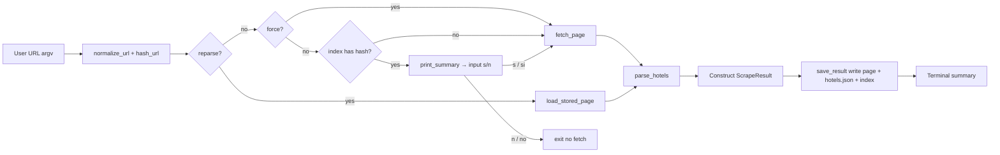

# Product Requirements Document: booking-scraper

**Document version:** 1.0  
**Last updated:** 2026-05-02  
**Scope:** Describes the shipped behavior of this repository’s Python codebase (`scraper.py` entrypoint and supporting modules).

---

## 1. Product Overview

### 1.1 What the product does

**booking-scraper** is a command-line utility that downloads a Booking.com search-results page for a given URL, parses hotel listings into structured records, persists the raw page and JSON output on disk, and maintains a local index for deduplication and quick redisplay of prior searches.

Primary capabilities:

1. **Fetch** a search-results URL from Booking.com hosts using configurable backends (direct HTTP or Firecrawl API).
2. **Parse** hotel cards from raw HTML or from markdown-derived text using regex-based heuristics tuned to common Booking layouts.
3. **Store** immutable artifacts under `output/results/<url_hash>/` and update `output/index.json`.
4. **Avoid redundant scraping** when the normalized URL was already scraped, unless overridden.
5. **Re-parse** stored pages without issuing new HTTP requests.

### 1.2 Target user

- **Individuals** (travel planning, researchers, analysts) comfortable with CLI and Python who want **offline snapshots** of search results and structured hotel fields for spreadsheets or scripts.
- **Power users / developers** who can supply a Firecrawl API key when Booking.com serves bot challenges instead of listings.

There is **no hosted service**, **no multi-tenant UX**, and **no GUI** beyond terminal output.

### 1.3 Value proposition

| Benefit | Mechanism |
|--------|-----------|
| **Repeatable archiving** | Normalized URLs + deterministic hash → stable folder per logical search |
| **Cost-aware re-scrapes** | Skip fetch if already scraped; `--reparse` reuses saved HTML/markdown |
| **Supplier-friendly parsing** | Firecrawl markdown path aligns with parsers expecting Firecrawl-style headings |
| **Transparent debugging** | Full page persisted (`page.html` or `page.md`) when parsing yields zero hotels |

---

## 2. Goals and Objectives

### 2.1 Business / product goals

| ID | Goal | Measurable indicator |
|----|------|----------------------|
| G1 | Persist a scrape for every distinct normalized search URL | Exactly one folder per SHA-256-derived 12-character hash appears under `output/results/` |
| G2 | Make re-scrapes optional | On cache hit without `--force`, `fetch_page` runs only after the user confirms overwrite (`s`/`si`); answering `n`/`no` exits without fetch. `--force` always fetches and skips the prompt. |
| G3 | Support both raw HTML and Firecrawl markdown | Successful parse produces non-empty `hotels[]` where page structure matches assumptions |
| G4 | Operate reliably on constrained networks | `httpx`: configurable timeout (`30`s) and retries (`MAX_RETRIES = 2` → up to `3` attempts) |

### 2.2 Non-goals (current release)

- Real-time pricing guarantees, availability, or booking execution.
- Compliance review with Booking.com terms of service (operators must self-assess).
- Pagination across multiple results pages beyond the single fetched URL document.

---

## 3. User Stories

### 3.1 Core flows

| ID | User story |
|----|-------------|
| US1 | **As a** traveler, **I want to** scrape a Booking.com URL once **so that** I can review hotel options offline without reloading the browser. |
| US2 | **As a** user repeating the same filters, **I want** the tool to recognize I already scraped that search **so that** I do not waste quota or bandwidth. |
| US3 | **As a** user improving the parser, **I want** to re-run extraction on saved HTML/markdown **so that** I do not re-hit Booking.com. |
| US4 | **As a** user behind anti-bot defenses, **I want** Firecrawl as a backend **so that** I receive real listing content instead of a challenge page. |
| US5 | **As a** user with many archived searches, **I want** `--list` to show prior runs **so that** I can find hashes and metadata quickly. |

### 3.2 Operational stories

| ID | User story |
|----|-------------|
| US6 | **As a** developer, **I want** explicit `--backend httpx \| firecrawl \| auto` **so that** I control cost vs reliability. |
| US7 | **As a** user whose JSON was corrupted, **I want** `--force` **so that** I can overwrite artifacts for the same normalized search. |

---

## 4. Functional Requirements

### 4.1 URL handling and deduplication

| ID | Requirement | Acceptance criteria |
|----|----------------|---------------------|
| F1 | Accept `http(s)` Booking.com URLs only for fetch operations | Fetch raises `RuntimeError` if scheme is not http(s) or host is not `booking.com` or `*.booking.com`. |
| F2 | Normalize URLs before hashing | Query parameters not in `KEEP_PARAMS` set are stripped; retained params are deterministically serialized (sorted via `urllib.parse.urlencode`). |
| F3 | Compute stable scrape identity | Hash is SHA-256 hex digest **truncated to 12 characters** of the normalized URL UTF-8 bytes. |

**Parameters retained for normalization** (`config.KEEP_PARAMS`):  
`checkin`, `checkout`, `dest_id`, `dest_type`, `group_adults`, `req_adults`, `no_rooms`, `group_children`, `req_children`, `age`, `req_age`, `flex_window`, `nflt`, `broad_search_not_eligible`.

Tracking-style parameters (`label`, `sid`, `aid`) are stripped for dedupe purposes.

### 4.2 Search parameter extraction (`url_utils.extract_search_params`)

Parsed from raw URL query (`parse_qs`):

| Field | Source key(s) | Notes |
|--------|---------------|-------|
| `checkin`, `checkout` | `checkin`, `checkout` | String, may be empty if absent |
| `dest_id`, `dest_type` | same names | Passed through for completeness |
| `adults` | `group_adults` | Parsed as `int`; invalid → `0` |
| `children` | `group_children` | Parsed as `int`; invalid → `0` |

### 4.3 Destination labeling (`extract_dest_label`)

Requirement: Produce a human-readable destination when possible.

**Priority:**

1. URL query `ss` or `highlighted_hotels` (first non-empty value, URL-decoded).
2. Last meaningful path segment (non-`.html` stripped, locale suffix trimmed, hyphen/underscore spaced and title-cased); skip digits-only segments and keywords `searchresults`, `hotel`.
3. HTML `<title>` patterns: `"Hotels in …"`, `"Hotel a …"`, `"Hotels à …"`, or `"Name: N properties"` / Italian `"propriet"`.
4. Markdown headings `#` / `##` first match in page body (excluding lines dominated by `"booking.com"`).

**Fallback:** Empty string—or in practice opaque IDs from title/slug failures (observed sample: `"911"`).

### 4.4 Page fetch (`fetcher`)

| ID | Requirement | Acceptance criteria |
|----|-------------|---------------------|
| F4 | **auto backend** | If `FIRECRAWL_API_KEY` env is non-empty (after strip): use Firecrawl; else `httpx`. |
| F5 | **httpx** | Async GET with browser-like UA, Accept headers, Referer Google, redirects followed, raises after `MAX_RETRIES + 1` failed attempts wrapping last error in `RuntimeError`. |
| F6 | **Firecrawl** | `POST https://api.firecrawl.dev/v1/scrape` JSON body `formats: ["markdown"]`, `waitFor: 5000` ms; Bearer token from env; raises if `success` false or missing `data.markdown`. |

Returned tuple from `fetch_page`: `(content, "firecrawl" | "httpx")` informs file suffix (`md` vs `html`).

### 4.5 Parsing (`parser.parse_hotels`)

| ID | Requirement | Acceptance criteria |
|----|-------------|---------------------|
| F7 | **Input flexibility** | If content looks like HTML (DOCTYPE/HTML near start up to heuristic window), strip tags via custom `HTMLParser` (block elements → newlines; skip script/style/noscript) before regex passes. |
| F8 | **Hotel segmentation** | New hotel starts when a line matches `### [Name\` markdown pattern (`re.search`) capturing name before `\`. |
| F9 | **Fields extracted** per hotel via regex / contains | See §7 Data Model for field semantics. Includes English and Italian locality suffixes (`Show on map` / `Mostra su mappa`), multiple rating wording patterns, `[See availability](https://www.booking.com/...)` link capture. |

**Known parser behaviors:**

- Ratings: comma decimal normalized to `.` internally as string storage.
- `price_per_night`: follows a line equal to `"Per night"` within next few lines matching currency-optional integers.
- `total_price`: from `"Current price …"` discounted line OR `Price <amount>` line.
- Boolean amenity flags via substring match: `"Free cancellation"`, `"No prepayment needed"` (English-only substrings).

### 4.6 Persistence (`storage`)

| ID | Requirement | Acceptance criteria |
|----|-------------|---------------------|
| F10 | **Directory layout** | `OUTPUT_DIR/results/<hash>/` exists; raw file `page.html` or `page.md`; structured `hotels.json`. |
| F11 | **Atomic index write** | `index.json` written via temp file in same folder + `os.replace`. |
| F12 | **Index entries** | One object per hash key storing URL pair, scrape timestamp (ISO UTC from caller), extracted search metadata, counts, paths to artifacts **relative to project root**. |
| F13 | **Load resilience** | Missing / invalid JSON index returns `{}`; corrupt lines do not crash load. |

**Path note:** JSON inside `hotels.json` embeds **`result.html_file` / `result.json_file` as resolved absolute path strings at save time** (see §7)—whereas **`index.json` stores repo-relative paths** for portability.

### 4.7 CLI orchestration (`scraper.py`)

| ID | Requirement | Acceptance criteria |
|----|-------------|---------------------|
| F14 | **Init** | Calls `init_storage()` → loads `.env` via python-dotenv, ensures `output/` trees exist. |
| F15 | **No URL** without `--list` | Prints argparse help text and exits status `1`. |
| F16 | **Cache hit path** | If not `force`, not `reparse`, entry exists for hash → load `hotels.json` via Pydantic and `print_summary` when the file exists; if JSON is missing, print indexed fields (scrape time, destinazione, `n_hotels`) plus warning. |
| F17 | **Cache overwrite confirmation** | After summary (F16), `input()` prompts in Italian (“Questa ricerca è già stata effettuata il *[first 19 chars of ISO `scraped_at`]* … (s/n)”). Answers **`s`** / **`si`** → `fetch_page` then `save_result` (same **`url_hash`** / **`output/results/<hash>/`**). **`n`** / **`no`** → exit **`0`** without fetch—case-insensitive **after strip**; invalid replies re-prompt with a clarifying Italian line. **`--force` bypasses this prompt** (immediate fetch). |
| F18 | **Reparse guard** | If `--reparse` and no saved page → error message referencing hash + exit gracefully (no traceback requirement). |

### 4.8 Terminal summaries

| Output mode | Behavior |
|-------------|----------|
| **After successful scrape** | Italian labels: destinazione (or N/A), date range, ospiti breakdown, ASCII table capped column widths (`name`/`location` truncation), filesystem paths printed. |
| **`--list`** | Sorted descending by `scraped_at`; columns include hash snippet, shortened destination label, date range, hotel count, shortened timestamp—or Italian empty message. |

*(UI copy is predominantly Italian despite English docstrings README—product behavior is bilingual at UX level.)*

---

## 5. Non-Functional Requirements

### 5.1 Performance

| Topic | Requirement / behavior |
|-------|------------------------|
| Fetch latency | Dominated by network + Booking response; HTTP client timeout **30 seconds** (`REQUEST_TIMEOUT`). |
| Firecrawl | Single POST, **60s** client-side timeout on scrape POST; **`waitFor: 5000` ms** server-side dwell in payload. |
| Parsing | Linear in document size string operations; regex over line-split content—suitable for single-page search results DOM/markdown snapshots. |

### 5.2 Security

| Concern | Mitigation / status |
|---------|---------------------|
| API keys | Loaded from environment / `.env` (`FIRECRAWL_API_KEY`); never printed by application code. |
| SSRF resistance | Fetch URL validated to Booking.com hosts only. |
| Data at rest | All outputs under user-controlled `output/` tree; **no encryption** enforced. |

### 5.3 Reliability

| Mechanism | Description |
|-----------|-------------|
| Retries | `httpx`: up to 3 tries total for transient failures. |
| Parsing robustness | HTML-to-text feeder swallows exceptions and returns raw HTML string fallback. |
| Index atomicity | Temp + replace minimizes torn `index.json` writes on crash mid-write (best-effort on common filesystems). |

### 5.4 Portability

| Aspect | Requirement |
|--------|-------------|
| Python | Depends on runtime supporting `asyncio`, type hints (`list[str] \| None` style), **Pydantic v2**. |
| OS | Paths via `pathlib`; WSL/Linux/macOS-friendly; absolute paths stored in older sample data may vary by machine—index entries prefer relative paths. |
| Dependencies | See §9 External Dependencies. |

---

## 6. Architecture Overview

### 6.1 Module responsibilities

```
┌─────────────┐     ┌─────────────┐     ┌─────────────┐
│ scraper.py  │────►│ url_utils   │     │ models.py   │
│ (CLI/flow)  │     │ normalize   │◄────│ Hotel       │
└──────┬──────┘     │ hash/params │     │ ScrapeResult│
       │             └─────────────┘     └──────▲──────┘
       │                                      │
       ├────────────► fetcher ────────────────┤
       │              (httpx/firecrawl)       │
       │                                      │
       ├────────────► parser ──────────────────┘
       │              (regex/HTML→text)
       │
       ├────────────► storage ───► filesystem (results + index)
       │
       └────────────► config (paths, constants, init_storage)
```

### 6.2 Data flow (successful scrape)



### 6.3 Runtime dependencies between modules

| Module | Imports |
|--------|---------|
| `scraper.py` | `asyncio`, `argparse`, `datetime`, `url_utils`, `fetcher`, `parser`, `config`, `storage`, `models` |
| `fetcher.py` | `httpx`, `urllib.parse`, `config` constants |
| `parser.py` | `re`, `html.parser.HTMLParser`, `models.Hotel` |
| `storage.py` | `json`, `os`, `tempfile`, `pathlib`, `config`, `models.ScrapeResult` |
| `url_utils.py` | `hashlib`, `re`, `html.unescape`, `urllib.parse`, `config.KEEP_PARAMS` |
| `config.py` | `pathlib`, `dotenv.load_dotenv` |

---

## 7. Data Model

### 7.1 `Hotel` (Pydantic)

| Field | Type | Semantic | Parsing source (typical) |
|-------|------|----------|--------------------------|
| `name` | `str` | Listing title | `### [...\` markdown pattern |
| `location` | `str` default `""` | City/area before map CTA suffix | Regex with `Show on map` / `Mostra su mappa` |
| `rating` | `str` default `""` | Numeric score as string (`9.1`) | Multilingual numeric patterns |
| `label` | `str` default `""` | Qualitative band | Explicit English literals set |
| `reviews` | `str` default `""` | Count as printed | `reviews`/`recensioni` pattern |
| `room` | `str` default `""` | First `#### heading` captured | Markdown room title |
| `price_per_night` | `str` default `""` | Integer string, commas stripped | `"Per night"` lookahead |
| `total_price` | `str` default `""` | Integer string after discount logic | Regex on price lines |
| `free_cancellation` | `bool` default `false` | Substring heuristic | Presence of phrase |
| `no_prepayment` | `bool` default `false` | Substring heuristic | Presence of phrase |
| `link` | `str` default `""` | Property deep link | `See availability` markdown link |

Strings are intentional (no enforced currency normalization beyond stripping commas).

### 7.2 `ScrapeResult` (Pydantic)

| Field | Type | Description |
|-------|------|-------------|
| `url` | `str` | Original argument URL |
| `url_normalized` | `str` | Canonical query-stripped Booking URL |
| `url_hash` | `str` | 12-hex-character hash ID |
| `scraped_at` | `str` | ISO UTC timestamp (`datetime.now(timezone.utc).isoformat()`) |
| `dest_label` | `str` | Heuristic destination name |
| `checkin`, `checkout` | `str` | From query parsing |
| `adults`, `children` | `int` | Party composition |
| `n_hotels` | `int` | `len(hotels)` at save |
| `hotels` | `list[Hotel]` | Parsed listings |
| `html_file` | `str` | Absolute path written to `"page"` file at save (**field name heritage: may be `.md`**). |
| `json_file` | `str` | Absolute path of `hotels.json` |

**Serialization:** `model_dump_json(indent=2)` with UTF-8 file write (`ensure_ascii` false at index level).

### 7.3 `index.json` schema

Root: **JSON object** mapping **`url_hash`** → metadata object.

Each entry:

```json
{
  "<12-char-hash>": {
    "url": "...",
    "url_normalized": "...",
    "scraped_at": "2026-04-30T14:14:00.973391+00:00",
    "dest_label": "",
    "checkin": "2026-06-17",
    "checkout": "2026-06-20",
    "adults": 2,
    "children": 1,
    "n_hotels": 73,
    "html_file": "output/results/<hash>/page.html",
    "json_file": "output/results/<hash>/hotels.json"
  }
}
```

Notes:

- Paths in index are **`Path.relative_to(PROJECT_ROOT)`** strings when saved by current code.
- Legacy workspaces may contain **absolute paths** (`html_file`/`json_file`); **`resolve_stored_path`** resolves either form.

---

## 8. CLI / Interface Specification

Invoked as: **`python scraper.py [options] [<url>]`**

### 8.1 Positional arguments

| Name | Req | Description |
|------|-----|-------------|
| `url` | Conditional | Full Booking search-results URL. **Required unless** `--list` is used. |

Shell quoting requirement: Operators must quote URLs containing shell metacharacters (`&`, `?`, `#`).

### 8.2 Options / flags

| Flag | Values | Default | Effect |
|------|--------|---------|--------|
| `--force` | boolean | False | Bypass cache overwrite **`input()`** prompt and visit cache → always fetch (unless `--reparse` path). Overwrites artifact directory contents for that hash (`write_text` replacements). |
| `--reparse` | boolean | False | Loads stored `page.html` or `page.md` via hash computed from normalized input URL → parse only; errors if absent. `--force` not required to refresh JSON from stale HTML manually if cache miss logic bypassed—not combined with initial visit skip except user supplies matching URL hash content. *(Product behavior: skips fetch entirely.)* |
| `--backend` | `auto`, `httpx`, `firecrawl` | `auto` | Select fetch implementation; **`auto`** keys off presence of **`FIRECRAWL_API_KEY`**. Ignored during `--reparse`. |
| `--list` | boolean | False | Print index table sorted by scrape time descending; **`url` not required.** |

Mutually nuanced flows:

| `--force` | `--reparse` | Interpretation |
|-----------|---------------|----------------|
| False | False | Known hash → show cached **`print_summary`** + overwrite prompt (`input`); fetch only if user confirms `s`/`si` |
| True | False | Always fetch (`--force`); skips overwrite prompt |
| * | True | Ignore cache for fetch logic; loads disk; **does not honor `--force`** for fetch (already no HTTP) |

### 8.3 Exit codes / stdout behavior

| Condition | Behavior |
|-----------|----------|
| Missing URL and no `--list` | Help rendered to stdout; **`sys.exit(1)`**. |
| Success paths | Writes files; textual summaries to stdout; exit code **`0`** (implicit). |

Non-zero exits on networking / Firecrawl / validation errors propagate as exceptions (CLI does not uniformly catch)—**operators should expect traceback on hard failures**.

### 8.4 Output artifacts (formats)

| File | Format | Encoding |
|------|--------|----------|
| `page.html` / `page.md` | Raw document | UTF-8 text (`write_text`) |
| `hotels.json` | JSON (indented 2 spaces) | UTF-8 |

No CSV, parquet, or XML export is implemented.

### 8.5 Environment variables

| Variable | Required | Purpose |
|----------|----------|---------|
| `FIRECRAWL_API_KEY` | Optional but necessary for reliable Firecrawl path | Bearer token for API |

**.env loading:** automatic via `load_dotenv()` during `init_storage()`.

---

## 9. External Dependencies

### 9.1 Python libraries (`requirements.txt`)

| Package | Min version constraint | Usage |
|---------|-------------------------|-------|
| `httpx` | `>= 0.27` | Async HTTP client; Firecrawl POST |
| `pydantic` | `>= 2.0` | `BaseModel`, JSON IO |
| `python-dotenv` | `>= 1.0` | `.env` load |

### 9.2 Firecrawl API

**Endpoint:** `POST /v1/scrape` host `api.firecrawl.dev`.

**Authentication:** Header `Authorization: Bearer <token>`.

**Request shape (implemented):**

```json
{
  "url": "<booking url>",
  "formats": ["markdown"],
  "waitFor": 5000
}
```

**Assumed success envelope:** `{ "success": true, "data": { "markdown": "..." } }`. Any deviation yields `RuntimeError` with truncated diagnostic string.

### 9.3 Booking.com structural assumptions

The parser implicitly assumes textual patterns derived from Booking’s search UI when rendered:

- Listing titles surfaced as Markdown `### [Name …` fragments (Firecrawl path) OR equivalent line structure after HTML→text stripping.
- Map call-to-action snippets adjacent to locality text.
- English amenity snippets for cancellations/prepayment.
- Price presentation including `"Per night"` sentinel line and `$`/`€`/£/`¥`-tolerant numeric lines.
- “See availability” deep links on `booking.com` domain.

Booking may **A/B test markup**, localize strings beyond covered patterns, paginate infinite scroll listings (only captured content is what's in downloaded document), inject CAPTCHAs, or change headings—breaking parsing without code updates.

---

## 10. Constraints and Limitations

| Category | Limitation |
|---------|-------------|
| **Legal / ToS** | Scraping may conflict with Booking.com terms; automated access risk is entirely on operator. |
| **Single-seat** | Filesystem concurrency not designed for parallel writes without external coordination. |
| **No automated tests** | Repository contains **no pytest/unittest suites** enforcing regressions—validation is manual. |
| **Regex fragility** | Parser is heuristic; locales not fully enumerated; `"dest_label"` can degrade to opaque IDs (`dest_id`). |
| **Single page capture** | No iterator for `"next page"` URLs—only explicitly provided search URL downloaded. |
| **Field completeness** | Some hotels may miss optional fields (`label`, prices) depending on snippet presence. |
| **Language mix** | Output tables Italian; parsing patterns English-heavy with partial Italian locality token. |
| **httpx path** | High likelihood of CAPTCHA / anti-bot gate—README acknowledges operational reality. |
| **Pricing semantics** | Numeric strings lack currency linkage in model (currency symbol optionally stripped inconsistently depending on patterns). |

---

## 11. Future Roadmap (suggested backlog)

Prioritized enhancements **not implemented** today:

| Theme | Potential work |
|-------|----------------|
| Quality | Automated tests (fixture HTML/markdown golden files); CI pipeline |
| Parsing | Localization matrix; DOM-selectors fallback (BeautifulSoup) parallel to regex |
| Data | Persist to SQLite/DuckDB; schema migrations; nightly diff jobs |
| Product | Pagination helper (derive `offset` URLs responsibly), multi-city batch config file |
| Multi-site | Abstraction layers for Airbnb, Hotels.com—with separate parsers & legal review |
| UX | Structured logging (JSON), `--quiet/--json` machine-readable CLI |
| Robustness | Exponential backoff, respectful rate limiting, Retry-After support |
| Security | Optionally encrypt at rest; scrub affiliate params from persisted hotel links |

---

## 12. Glossary

| Term | Definition |
|------|------------|
| **Normalized URL** | Booking URL with irrelevant tracking query params removed and kept params serialized consistently; basis for equality & dedupe. |
| **URL hash** | 12 hexadecimal character prefix of SHA-256(normalized URL); directory name under `results/`. |
| **Firecrawl** | External hosted scrape/rendering API (`api.firecrawl.dev`) used to obtain markdown snapshots of Booking pages. |
| **Backend** | Transport strategy retrieving page bytes/markdown (`httpx`, `firecrawl`, `auto`). |
| **Re-parse** | Re-run `parse_hotels` on previously stored `page.(html|md)` without fetching. |
| **Index** | `output/index.json` manifest mapping hashes → metadata pointers. |
| **Hotel card** | Contiguous textual block representing one property in listings—parser state machine delineated by headings & patterns. |
| **CAPTCHA / challenge page** | Bot interstitial HTML lacking listing patterns—parses yield zero hotels. |
| **`KEEP_PARAMS`** | Allowlist influencing deduplication fidelity—must be tuned when adding Booking query dimensions. |
| **Pydantic** | Python runtime validation/library used for serialization of models. |

---

## Appendix A: File map (Python)

| File | Responsibility summary |
|------|-------------------------|
| `config.py` | Paths, HTTP constants, `KEEP_PARAMS`, `init_storage()` |
| `url_utils.py` | URL canonicalization & hashing & metadata extraction |
| `fetcher.py` | Booking-only HTTP fetch backends |
| `parser.py` | HTML/text normalization & regex extraction pipeline |
| `models.py` | `Hotel`, `ScrapeResult` schemas |
| `storage.py` | Persistence + atomic index merges + path resolution helpers |
| `scraper.py` | CLI argparse + asyncio orchestration |

---

## Appendix B: Change control

Updates to **`KEEP_PARAMS`**, **`parse_hotels` patterns**, **Firecrawl payload**, or **CLI contract** constitute **feature changes** affecting dedupe fidelity and reproducibility operators depend on—the PRD should be revised accordingly.
